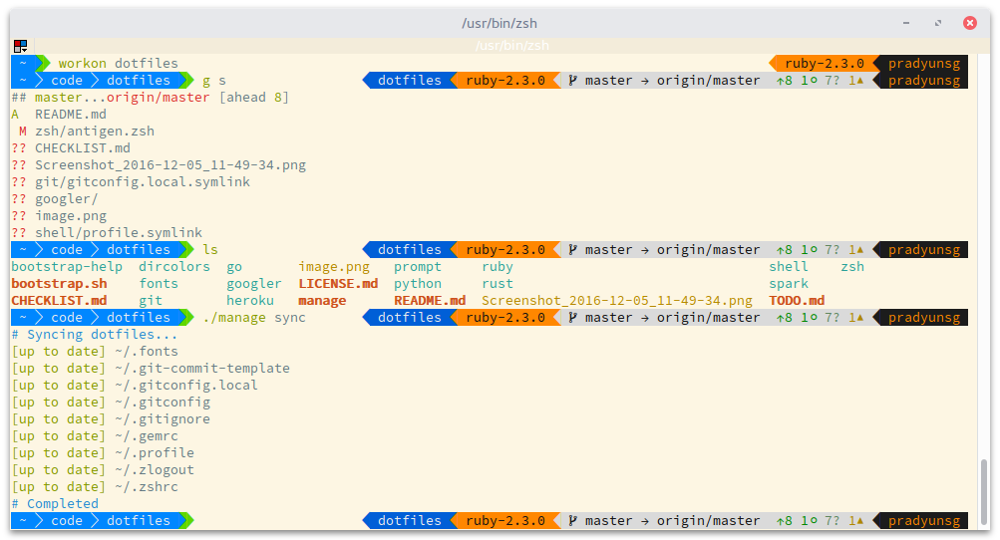

<h1 align="center">
  pradyunsg's Dotfiles
</h1>
<p align="center">
  Magical objects that make certain computers extremely use-able for me.
</p>

<p align="center">
  <a href="#installation">Installation</a> |
  <a href="#customization">Customization</a> |
  <a href="#license">License</a> |
  <a href="#contributing">Contributing</a> |
  <a href="#acknowledgements">Acknowledgements</a>
</p>

<p align="center">
  
</p>

## Installation

- Run `scripts/bootstrap`
- Run `scripts/setup`

## How stuff is organised

This uses the topical layout from [@holman's dotfiles](https://github.com/holman/dotfiles). The actual mechanism for handling files is completely different, however.

### Git

You need to configure your name, email and signingKey in a `~/.gitconfig.local` file.

```ini
[user]
	name = "Pradyun Gedam"
	email = "pradyunsg@users.noreply.github.com"
	signingKey = "..."
```

## Additional repositories

`scripts/setup` uses a `~/.dotfiles.toml` file for determining what files need to be brought over. This is generated in `scripts/bootstrap`, if you really want to have fun.

You can add an additional repository by name, by adding another entry to the `[repositories]` table in the `~/.dotfiles.toml` file.

```
work = "/Users/pradyunsg/work-dotfiles"
```

### Resolving conflicts between repositories

If two repositories provide the same dotfile, you can set up an override using the `[[conflicts]]` array of tables.

```
[[conflicts]]
file = ".bashrc"
use = ["work"]

[[conflicts]]
file = ".zshrc"
use = ["personal"]
```

## License

The contents of this repository are licensed under the GPL v3 license.
