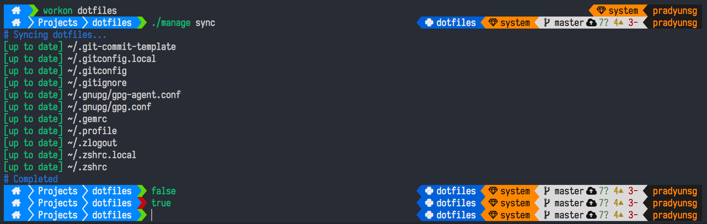

<h1 align="center">
  pradyunsg's Dotfiles
</h1>
<p align="center">
  Magical objects that make certain computers extremely use-able for me.
</p>


<p align="center">
  <a href="#goals">Goals</a> |
  <a href="#installation">Installation</a> |
  <a href="#customization">Customization</a> |
  <a href="#license">License</a> |
  <a href="#contributing">Contributing</a> |
  <a href="#acknowledgements">Acknowledgements</a>
</p>



## Goals
- Configure essential tools and software
    - git (with a good bunch of aliases)
    - Python (virtualenv, virtualenvwrapper, pip)
    - IPython
    - Rust Lang
    - Go Lang
- Multi-platform support
    - Ubuntu
    - Debian (working on this)
    - OSX    (once I get hold of *my* MacBook)
- Custom dircolors
- Create a productive working environment for myself

> NOTE: The prompt I use is currently not accessible to everyone. The `sigma-prompts` repository is currently not public. I'll make it public once it's a little cleaner and more robust.


## Installation
Currently, it is required to create a Python 3.4+ virtual environment and with that active, execute bootstrap.sh

```
virtualenv .venv
source .venv/bin/activate
./bootstrap.sh
deactivate
```

Make sure you create a `~/.gitconfig.local` for storing your credentials. Here's a template, if you're feeling lazy (replace everything in `{}` including the braces) :

```ini
[user]
    email = {your-email-id@example.com}
    name = {Your Name}

# Pro-tip: This makes working with sub-modules easier.
[url "git@github.com:{your-github-id-here}/"]
    insteadOf = "git://github.com/{your-github-id-here}/"
```

## Customization
You can do customization using `.local` files:

  - `~/.gitconfig.local`
      - This is sourced before any other files from this folder.
  - `~/.zshrc.local`
      - This is sourced before any other files from this folder.

These `.local` files can be used to add a few custom commands without the need to fork this entire repository, or to add commands you don’t want to commit to a public repository.

As things currently stand, these 2 files can modify nearly everything.

## License
The contents of this repository are licensed under the liberal MIT license.

## Contributing
If you have any ideas or suggestions, feel free to open up an issue or shoot through a pull request! Thanks!

Feel free to fork whenever you want!

## Acknowledgements
Uses parts of or inspired by:

- [@nicksp](https://github.com/nicksp/dotfiles)
- [@westurner](https://github.com/westurner/dotfiles)
- [@holman](https://github.com/holman/dotfiles)
- [@jeffaco](https://github.com/jeffaco/dotfiles)
- [@paulmillr](https://github.com/paulmillr/dotfiles)
- [@mathiasbynens](https://github.com/mathiasbynens/dotfiles)
- I'm sure there's more places that I've lost track of. :sweat_smile:
